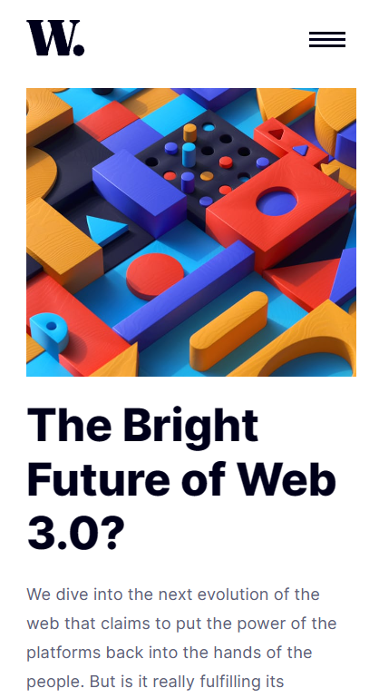
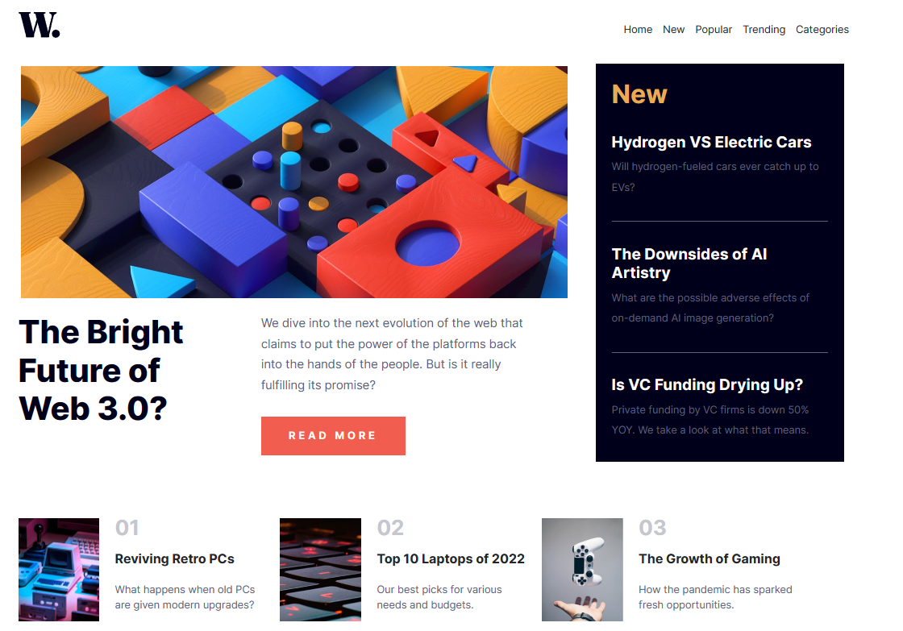

# Web Developer Journey: FrontEnd Mentor Challenge #3

## Frontend Mentor - News homepage solution

This is a solution to the [News homepage challenge on Frontend Mentor](https://www.frontendmentor.io/challenges/news-homepage-H6SWTa1MFl/hub). Frontend Mentor challenges help you improve your coding skills by building realistic projects.lenge, you need a good understanding of HTML and CSS.**

## Table of contents
- [Overview](#overview)
    - [The challenge](#the-challenge)
    - [Screenshot](#screenshot)
    - [Links](#links)
  - [My process](#my-process)
    - [Built with](#built-with)
    - [What I learned](#what-i-learned)
    - [Continued development](#continued-development)
    - [Useful resources](#useful-resources)
  - [Author](#author)

# Overview

### The challenge

> Users should be able to:
  - View the optimal layout depending on their device's screen size
  - See hover and focus states for interactive elements
  -  **Bonus**: Toggle the mobile menu (requires some JavaScript)

### Screenshot
.
.

### Links

- Solution URL: https://github.com/raszpberry/WebDevJourney-FrontEndMentor/tree/main/FrontEndMentor-3
- Live Site URL: https://fem-challenge-news-homepage.netlify.app/

## My process

### Built with

- Semantic HTML5 markup
- CSS custom properties
- Flexbox
- CSS Grid
- Mobile-first workflow
- Bootstrap 5

### What I learned

- I learned a lot about the thought process of creating complex website layouts but still a long way to go and I found this challenge perfect for practicing layouts 
- Bootstrap 5 helped me make things responsive as I still have trouble wrapping my head around min vs. max widths, and proper responsive layout techniques
- CSS is really complex and made me want to use SASS because of this challenge.

### Continued development

- This challenge made me realize that I need to improve my use of media queries and to do a lot more of css variables as it could really help on reducing the amount of changes I need to modify.
- This solution was supposed to be made with JS but I still need to learn more about it so I had to use Bootstrap 5, will update this after I can confidently use JS

### Useful resources

- [W3Schools](https://www.w3schools.com/) - This helped me grasp the css variable, flexbox, and css grid. A really good website for beginners like me.  
- [Bootstrap 5 Documentation](https://getbootstrap.com/docs/5.3/getting-started/introduction/) - I just followed this documentation without relying much on videos, it helps you be more creative

## Author

- [Personal Website](https://raszpberry.github.io/rasz-web/#home)
- [GitHub](https://github.com/raszpberry)
- [CodePen](https://codepen.io/raszpberry)
- [Frontend Mentor](https://www.frontendmentor.io/profile/raszpberry)
- [Twitter](https://www.twitter.com/traszty)
- [Youtube](https://www.youtube.com/channel/UCoPKWMX2adD4bNw2njUdhBQ)